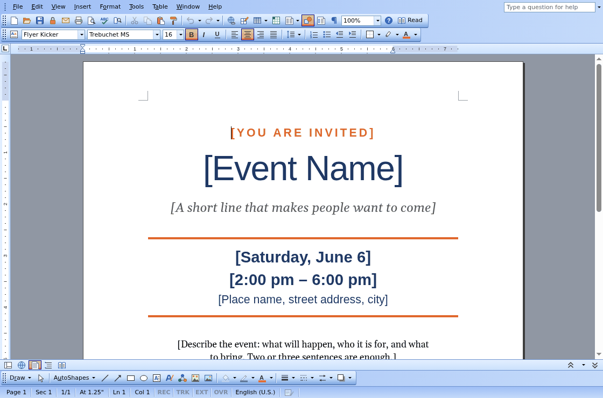
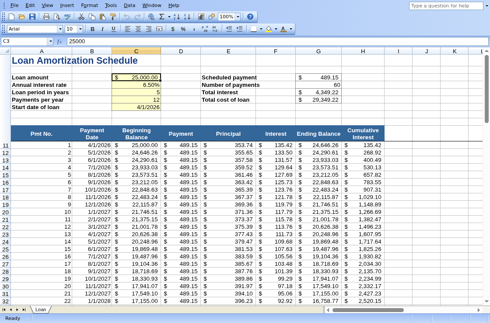
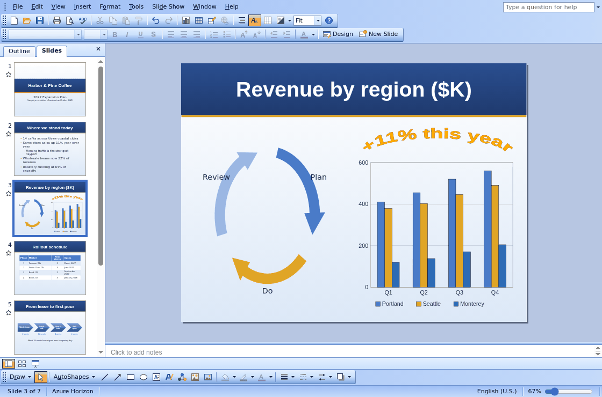

<h1 align="center">VibeOffice</h1>

  <b>A word processor, a spreadsheet and a presentation editor that run in your browser.</b> 
  They open and save real .docx, .xlsx and .pptx files. Nothing to install, no account, and your files never leave your computer.

  <a href="https://vibeoffice.work"><b>▶&nbsp;&nbsp;Try it now at vibeoffice.work</b></a>

<table>
  <tr>
    <td align="center" width="33%">
       
      <b><a href="https://vibeoffice.work/quire/">Quire</a></b> Word processor
    </td>
    <td align="center" width="33%">
       
      <b><a href="https://vibeoffice.work/ledger/">Ledger</a></b> Spreadsheet
    </td>
    <td align="center" width="33%">
       
      <b><a href="https://vibeoffice.work/lectern/">Lectern</a></b> Presentations
    </td>
  </tr>
</table>

## Why VibeOffice

- **Familiar.** The menus, toolbars and task panes of the classic Office 2003 look, so there is nothing new to learn.
- **Lossless editing.** Open what colleagues send you, and save files built to open in Microsoft Office and LibreOffice, without losing what you didn't touch (below).
- **Private.** Everything runs on your machine. There is no server behind it, no upload and no sign-in.
- **Installable.** In Chrome or Edge, install it from the Start Center. It then opens .docx, .xlsx and .pptx files from your file manager.

## Lossless editing

The goal: edit a Word, Excel or PowerPoint file here, save it in the same format, and send it to someone who uses Microsoft Office. It opens for them without an error or repair message, with your changes in place and everything else exactly as it was.

- **What VibeOffice can't edit for now, it keeps.** VBA macros, embedded objects, SmartArt, video and audio, ink, 3-D models, custom XML and Office's newer extensions are written back byte for byte. Content it does edit keeps its original names and IDs, so links, comments and animations still point where they did.
- **Edits change only what you changed.** Move or resize an object VibeOffice can't edit, and only its position changes. Set a shape's shadow, and its unsupported attributes stay.
- **Each app's own features survive:**
  - **Word:** content controls and their data bindings, comments, watermarks, section and numbering properties.
  - **Excel:** pivot tables (refreshed by Excel when their source changed), slicers and timelines, threaded comments with @mentions, form controls, query tables.
  - **PowerPoint:** media, sections and custom shows, comments, unused slide layouts, tags, actions and effects.
- **Nothing lost silently.** If a save would drop something you would miss, the Compatibility Checker will show a warning.

4,697 real files from public test collections (LibreOffice, Apache POI, Open XML SDK) are opened, saved, edited, undone and recovered, and every save is compared with the original. Where the apps stand today, the known gaps and what comes next: [docs/LOSSLESS_SAVE.md](docs/LOSSLESS_SAVE.md).

## The apps

| App | | Opens and saves |
|---|---|---|
| [Quire](docs/quire.md) | Word processor | .docx, .docm, .dotx, .dotm, .rtf, .htm, .txt, Markdown (.md, or .zip with pictures); PDF |
| [Ledger](docs/ledger.md) | Spreadsheet | .xlsx, .xlsm, .xltx, .xltm, .csv, XML Spreadsheet 2003, .htm; PDF |
| [Lectern](docs/lectern.md) | Presentations | .pptx, .pptm, .ppsx, .ppsm, .potx, .potm; PDF, PNG, .htm |

Start at vibeoffice.work, the Start Center: open a file, pick one from Recent Files, or create a document, spreadsheet or presentation from a blank page or a template.

## Feedback and contributing

Found a file that doesn't open or save the way it should? Please [open an issue](https://github.com/tcchen2026/VibeOffice/issues).

VibeOffice is plain HTML and JavaScript with no build step. Read [AGENTS.md](AGENTS.md) for the design rules and [docs/testing.md](docs/testing.md) for running it locally and testing.

## License

Apache License 2.0, see [LICENSE](LICENSE). Two folders carry their own licences, listed in each folder's `LICENSES.txt`: the proofing word lists and thesaurus in `public/common/dict/`, and the fonts in `public/fonts/` (Carlito, Caladea and Gelasio, under the SIL Open Font License 1.1).

VibeOffice is an independent project. Microsoft, Word, Excel, PowerPoint and Office are trademarks of Microsoft Corporation; VibeOffice is not affiliated with Microsoft.
